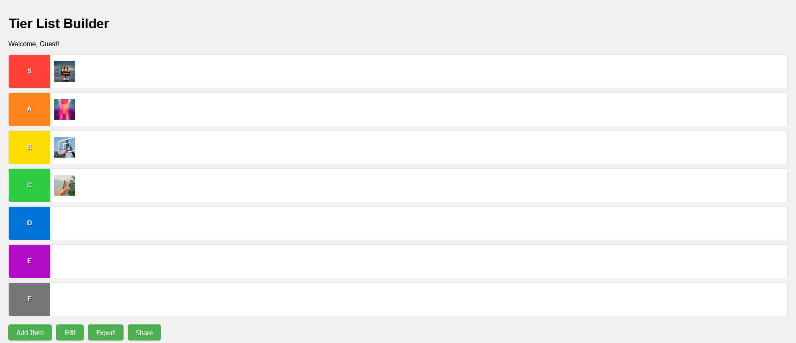

# TierListBuilder


Tier List Builder is a web application that allows users to create, customize, and share tier lists. Whether you're ranking your favorite movies, video game characters, or anything else, this tool provides an intuitive interface for organizing items into tiers.

## Features

- **Dynamic Tier Creation**: Create tiers ranging from S (top) to F (bottom).
- **Drag and Drop**: Easily move items between tiers with a simple drag and drop interface.
- **Image Search**: Integrated Unsplash API for searching and adding images to your tier list.
- **Customization**: Edit tier names to suit your specific ranking needs.
- **Export**: Save your tier list as an image for easy sharing.
- **Sharing Options**: Share your tier list via email or on forums (forum sharing coming soon).

## Technologies Used

- Node.js
- Express.js
- Pug (templating engine)
- HTML5 (with drag and drop API)
- CSS3
- JavaScript (ES6+)
- Unsplash API for image search
- html2canvas for image export

## Installation

1. Clone the repository:
```bash
git clone https://github.com/royanirudd/TierListBuilder.git
```
2. Install dependencies:
```bash
npm install
```
3. Create ```.env``` and add Unsplash API key
4. Start server with ```npm run```

6. Open your browser and visit `http://localhost:3000` (or the port you've configured).

<details>
<summary><strong>Usage</strong></summary>

1. Click "Add Item" to open the item creation modal.
2. Enter an item name and search query for an image.
3. Select an image from the search results to add it to your tier list.
4. Drag and drop items between tiers to organize your list.
5. Use the "Edit" button to customize tier names.
6. Click "Export" to save your tier list as an image.
7. Use the "Share" button to share your tier list via email.

</details>

<details>
<summary><strong>Contributing</strong></summary>

Contributions are welcome! Please feel free to submit a Pull Request.

1. Fork the repository
2. Create your feature branch (`git checkout -b feature/AmazingFeature`)
3. Commit your changes (`git commit -m 'Add some AmazingFeature'`)
4. Push to the branch (`git push origin feature/AmazingFeature`)
5. Open a Pull Request

</details>

<details>
<summary><strong>License</strong></summary>

This project is licensed under the MIT License - see the [LICENSE.md](LICENSE.md) file for details.

</details>

<details>
<summary><strong>Acknowledgments</strong></summary>

- Thanks to Unsplash for providing the image search API.
- html2canvas library for enabling image export functionality.

</details>

<details>
<summary><strong>Future Enhancements</strong></summary>

- Implement user accounts for saving and managing multiple tier lists.
- Add more sharing options, including direct links and social media integration.
- Introduce collaborative editing features for group tier list creation.
- Develop a mobile app version for on-the-go tier list building.

</details>

## Contact

If you have any questions, feel free to reach out to [Anirudh Roy] at [aniruddroy704@gmail.com].

Project Link: [https://github.com/royanirudd/TierListBuilder](https://github.com/royanirudd/TierListBuilder)
